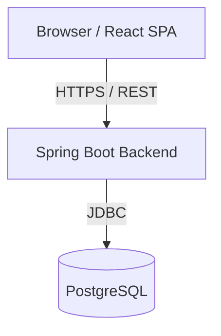

# System Architecture - SOE Asset Management

## 1. System Overview

The SOE Asset Management System is a full-stack web application designed for State-Owned Enterprises to manage their fixed assets, consumable stock, handovers, and liquidations. 

The architecture follows a standard client-server model:
- **Client (Frontend):** A Single Page Application (SPA) built with React and TypeScript, running in the browser.
- **Server (Backend):** A monolithic Spring Boot REST API providing business logic, data access, and security.
- **Database:** A PostgreSQL relational database holding all system state.



---

## 2. Technology Stack

### Backend
- **Framework:** Java 17 + Spring Boot 3.2.x
- **Data Access:** Spring Data JPA / Hibernate
- **Security:** Spring Security + JWT
- **Database Migration:** Flyway
- **Testing:** JUnit 5, Mockito, H2 in-memory DB

### Frontend
- **Framework:** React 19 + TypeScript
- **Build Tool:** Vite
- **State Management:** Zustand
- **UI Component Library:** Ant Design (v6)
- **HTTP Client:** Axios (with interceptors)

### Infrastructure
- **Database Engine:** PostgreSQL 15 (Dockerized)

---

## 3. Backend Architecture

The backend follows a **Domain-Driven Module Structure** combined with a standard layered architecture inside each module.

### 3.1. Package Structure
Instead of packaging by layer (e.g., all controllers together), the project is packaged by feature/domain:

```
vn.edu.hust.soict.soe.assetmanagement
├── asset/          # FA-01 to FA-04: Fixed asset registry & depreciation
├── audit/          # RP-01: Immutable system-wide audit logging
├── auth/           # Login & JWT generation/validation
├── common/         # Cross-cutting abstractions (BaseEntity, ApiResponse)
├── config/         # Spring Boot configurations (Security, CORS, JPA)
├── exception/      # Global exceptions (BusinessRuleException, ResourceNotFoundException)
├── handover/       # HL-01, HL-03: Handover workflows
├── liquidation/    # HL-02, HL-03: Liquidation workflows
├── lookup/         # Read-only reference data for dropdowns
├── report/         # RP-02, RP-03: Asset & Stock reports
├── stock/          # CS-01 to CS-04: Consumable materials & transactions
└── user/           # User & Managing Unit administration
```

### 3.2. Layering Pattern
Within each domain module, the standard Spring layer pattern is applied:
1. **Controller (`*Controller.java`):** Handles HTTP routing, input validation (@Valid), and Role-Based Access Control (@PreAuthorize). Calls the Service layer. Returns `ApiResponse<T>`.
2. **Service (`*Service.java`):** Contains pure business logic. Enforces business rules (e.g., separation of duties). Transaction boundary (@Transactional). Calls the Repository layer and other Services.
3. **Repository (`*Repository.java`):** Spring Data JPA interfaces. Defines custom JPQL queries.
4. **DTO (`*Dto.java` / `*Request.java`):** Data Transfer Objects for API requests and responses. Entities never leave the Service layer.
5. **Entity (`*Entity.java`):** JPA Entity representing database tables. Extends `BaseEntity` (unless append-only).

### 3.3. Key Cross-Cutting Concerns
- **Audit Logging:** Implemented in `AuditLogService`. Called explicitly by domain services when mutating critical state (e.g., in `HandoverService`).
- **Standardized API Responses:** Every controller endpoint wraps its return value in `ApiResponse.success()` or `ApiResponse.error()`.
- **Global Exception Handling:** `@RestControllerAdvice` in `GlobalExceptionHandler` catches domain exceptions (`BusinessRuleException`, `ResourceNotFoundException`) and returns standardized JSON error responses.

---

## 4. Frontend Architecture

### 4.1. Application Structure
The frontend is a Vite-powered React SPA.

```
frontend/src
├── api/            # Axios instance and domain-specific API clients
├── assets/         # Static assets (images, icons)
├── components/     # Reusable UI components (AppLayout, PageHeader)
├── pages/          # Route-level components grouped by domain
├── store/          # Zustand global state stores
├── types/          # TypeScript interfaces (DTO definitions matching backend)
└── utils/          # Helper functions (formatCurrency, formatDate)
```

### 4.2. State Management (Zustand)
The application avoids complex state management libraries like Redux, utilizing **Zustand** for simple, globally accessible state:
- `useAuthStore`: Manages the JWT token and the currently authenticated user's profile (`CurrentUser`). Persists to `localStorage`. Exposes helpers like `isAuthenticated()` and `hasRole()`.
- `useNotificationStore`: Centralized toast/notification management.

### 4.3. API Layer
- **Axios Instance:** `axiosInstance.ts` defines the base URL and default timeout.
- **Request Interceptor:** Automatically injects the JWT token from `useAuthStore` into the `Authorization: Bearer <token>` header of every outgoing request.
- **Response Interceptor:** Globally catches HTTP 401 (Unauthorized) errors, clears local state, and redirects the user to the login page. It also handles surfacing backend error messages to the Ant Design `message` system.
- **Domain API Modules:** API calls are abstracted into domain-specific files (`assetApi.ts`, `handoverApi.ts`), keeping components free of raw `axios.get()` calls.

---

## 5. Security Model

### 5.1. Authentication (JWT)
The system uses stateless JSON Web Tokens (JWT).
1. Client POSTs to `/api/auth/login`.
2. Backend authenticates via Spring Security and issues a JWT signed with a secret key.
3. Client stores the JWT (Zustand `useAuthStore` → localStorage).
4. `JwtAuthFilter` intercepts incoming requests, validates the signature, extracts the username, loads authorities (Roles), and populates the Spring `SecurityContext`.

### 5.2. Role-Based Access Control (RBAC)
Roles map directly to the Bảng 2.6 specifications:
- `SYSTEM_ADMIN`, `ASSET_MANAGER`, `WAREHOUSE`, `APPROVING_AUTH`, `FINANCE_AUDIT`.

**Enforcement:**
- **URL-Level:** Broad access rules defined in `SecurityConfig.java` (e.g., `/api/users/**` is restricted to `SYSTEM_ADMIN`).
- **Method-Level:** Granular rules via `@PreAuthorize` annotations on specific controller endpoints or service methods.
- **Frontend-Level:** The `roleGuard` utility and `hasRole()` checks in Zustand dynamically hide UI elements (buttons, menu items, routes) that the user lacks permissions for.

### 5.3. Role Permissions Matrix

The system defines **5 roles** mapped to Vietnamese SOE organizational structure. Each role has specific permissions across different modules:

| Module / Action | SYSTEM_ADMIN | ASSET_MANAGER | WAREHOUSE | APPROVING_AUTH | FINANCE_AUDIT |
|---|:---:|:---:|:---:|:---:|:---:|
| **Authentication** |
| Login | ✓ | ✓ | ✓ | ✓ | ✓ |
| View own profile | ✓ | ✓ | ✓ | ✓ | ✓ |
| **User Management** |
| List all users | ✓ | ✗ | ✗ | ✗ | ✗ |
| Create users | ✓ | ✗ | ✗ | ✗ | ✗ |
| Edit users | ✓ | ✗ | ✗ | ✗ | ✗ |
| Assign roles | ✓ | ✗ | ✗ | ✗ | ✗ |
| **Fixed Assets** |
| View assets | ✓ | ✓ | ✗ | ✓ | ✓ |
| Create assets | ✓ | ✓ | ✗ | ✗ | ✗ |
| Edit assets | ✓ | ✓ | ✗ | ✗ | ✗ |
| Change asset status | ✓ | ✓ | ✗ | ✗ | ✗ |
| View asset history | ✓ | ✓ | ✗ | ✓ | ✓ |
| **Consumable Stock** |
| View materials | ✓ | ✗ | ✓ | ✓ | ✓ |
| Create materials | ✓ | ✗ | ✓ | ✗ | ✗ |
| Edit materials | ✓ | ✗ | ✓ | ✗ | ✗ |
| Stock receipt (nhập kho) | ✓ | ✗ | ✓ | ✗ | ✗ |
| Stock issue (xuất kho) | ✓ | ✗ | ✓ | ✗ | ✗ |
| View stock balance | ✓ | ✗ | ✓ | ✓ | ✓ |
| **Handover Workflow** |
| View handover requests | ✓ | ✓ | ✗ | ✓ | ✗ |
| Create handover request | ✓ | ✓ | ✗ | ✗ | ✗ |
| Submit for approval | ✓ | ✓ | ✗ | ✗ | ✗ |
| Approve handover (Step 1) | ✓ | ✗ | ✗ | ✓ | ✗ |
| Confirm receipt (Step 2) | ✓ | ✓ | ✗ | ✓ | ✗ |
| Complete handover | ✓ | ✗ | ✗ | ✓ | ✗ |
| Reject handover | ✓ | ✗ | ✗ | ✓ | ✗ |
| **Liquidation Workflow** |
| View liquidation requests | ✓ | ✓ | ✗ | ✓ | ✗ |
| Create liquidation request | ✓ | ✓ | ✗ | ✗ | ✗ |
| Approve (Manager level) | ✓ | ✓ | ✗ | ✗ | ✗ |
| Approve (Director level) | ✓ | ✗ | ✗ | ✓ | ✗ |
| Complete liquidation | ✓ | ✗ | ✗ | ✓ | ✗ |
| Reject liquidation | ✓ | ✓ | ✗ | ✓ | ✗ |
| **Reports** |
| Asset reports | ✓ | ✗ | ✗ | ✓ | ✓ |
| Stock reports | ✓ | ✗ | ✗ | ✓ | ✓ |
| Export to Excel/PDF | ✓ | ✗ | ✗ | ✓ | ✓ |
| **Audit Log** |
| View audit logs | ✓ | ✗ | ✗ | ✗ | ✓ |
| **Lookup Data** |
| View reference data | ✓ | ✓ | ✓ | ✓ | ✓ |

**Notes:**
- `SYSTEM_ADMIN` has full access to all modules.
- **Separation of Duties:** A user who creates a handover/liquidation request cannot approve their own request (enforced at service layer).
- **Data Scoping:** All roles (except `SYSTEM_ADMIN`) see only data from their assigned Managing Units via `user_units` table filtering.

### 5.4. Managing Unit Scoping (Data Isolation)
Users belong to one or more Managing Units via the `user_units` join table.
While RBAC dictates *what actions* a user can perform, Managing Unit Scoping dictates *which data* they can see.

**Implementation:**
- When a user logs in, their JWT payload includes their assigned unit IDs.
- Backend service methods filter queries by managing unit: `WHERE asset.managingUnitId IN (:userUnitIds)`.
- `SYSTEM_ADMIN` bypasses this filter and sees all data across all units.

**Example:** An `ASSET_MANAGER` assigned to "Phòng Kế Toán" (PHKT) can create/edit assets, but only sees assets where `managing_unit_id` matches PHKT's UUID.

---

## 6. Key Workflows & Patterns

### 6.1. Workflow Management (Handover & Liquidation)
Complex workflows (e.g., transferring an asset) follow a deterministic state machine managed entirely in the backend service layer (`HandoverService`, `LiquidationService`).

**State Transitions (Handover):**
`DRAFT → PENDING_APPROVAL → APPROVED → CONFIRMED → COMPLETED` (or `REJECTED`)

**Key Design Principles:**
- **Separation of Duties:** The backend validates that `initiatedBy` != `approvedBy`.
- **Atomic Operations:** When a workflow reaches `COMPLETED`, the service atomically updates the request status, modifies the underlying `FixedAsset` (e.g., changing its status to `TRANSFERRED` and updating its owner unit), generates the formal document, and logs the audit event inside a single `@Transactional` method.

### 6.2. Data Integrity Patterns
- **Append-Only Tables:** Crucial financial and audit tables (`asset_history`, `stock_transactions`, `audit_logs`) have no `updated_at` columns. The backend provides no `UPDATE` or `DELETE` endpoints for these entities.
- **Computed Stock Balance:** To prevent race conditions and sync issues, consumable stock balance is never stored as a static column. It is always dynamically computed via SQL aggregation: `SUM(RECEIPT qty) - SUM(ISSUE qty)`.
- **Database Level Protection:** The `audit_logs` table relies on PostgreSQL `RULE` constraints to silently reject any `UPDATE` or `DELETE` commands, protecting the audit trail even against direct DBA intervention.

---

## 7. Module Ownership Mapping

Based on project requirements, responsibilities are cleanly divided:

| Owner | Domain / Responsibility | Relevant Code Locations |
|---|---|---|
| **M1** | Core Foundation & Auth | `auth`, `user`, `config`, `common`, `exception`, DB setup |
| **M2** | Fixed Assets | `asset`, Depreciation logic |
| **M3** | Consumable Stock | `stock`, Materials, Warehouse transactions |
| **M4** | Workflows & Reporting | `handover`, `liquidation`, `audit`, `report` |
| **M5** | Frontend | `frontend/src/*` (React + Ant Design) |
